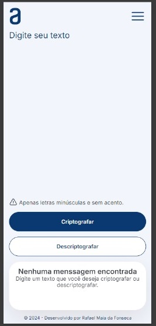
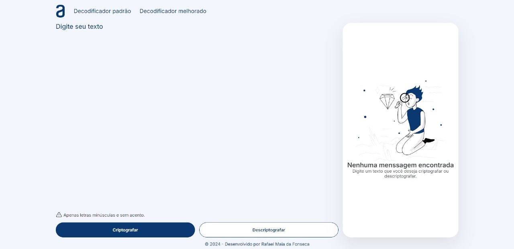

# Decodificador de Texto

Projeto do desafio do Decodificador de Texto desenvolvido para o programa ONE - Oracle Next Education em parceria com a Alura.

O projeto pode ser testado pelo link: <https://rafaelmaia23.github.io/Decodificador-de-Texto/index.html>

## Funcionalidades

O Decodificador de Texto possui a capacidade de criptografar e descriptografar textos. No decodificador, é usado um algoritmo de criptografia próprio com as chaves fornecidas para o desenvolvimento do projeto.

O projeto conta com um design responsivo, desenvolvido para ser mobile first.

### Decodificador Padrão

   
    
    

### Segundo Decodificador

Também foi desenvolvida uma segunda página com um segundo decodificador.

  
  
  

No segundo decodificador, é possível encriptar e descriptografar usando os algoritmos Base64 e AES.

  

Nas versões mobile, o projeto possui uma textarea de input com altura dinâmica que cresce de acordo com o tamanho do texto escrito pelo usuário.

  

Após a criptografia de um texto, um botão para copiar o texto aparece na área de output. Ao ser clicado, o texto é automaticamente copiado para o clipboard do usuário e uma notificação aparece na tela.

  
  

#### Projeto criado por Rafael Maia

GitHub: <https://github.com/rafaelmaia23>

LinkedIn: <https://www.linkedin.com/in/rafaelmaiadafonseca/>
